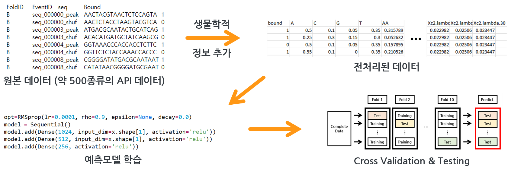
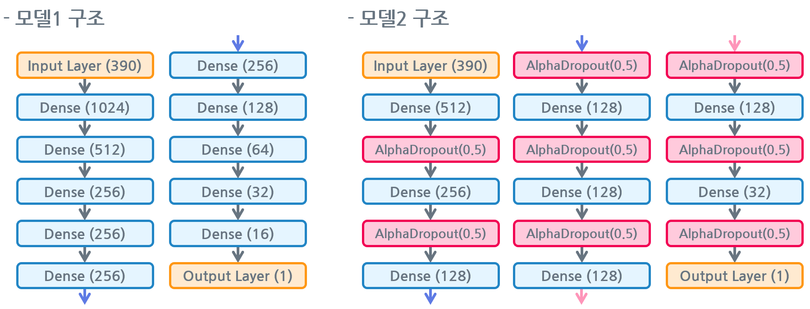

# AptBindCommend
2022 PNU CSE ML깎는컴공 Graduation assignment (Project ABC)

## 목차

- 1. [프로젝트 소개](#1-프로젝트-소개)
- 2. [팀 소개](#2-팀-소개)
- 3. [구성도](#3-구성도)
- 4. [소개 및 시연 영상](#4-소개-및-시연-영상)
- 5. [사용법](#5-사용법)

## 1. 프로젝트 소개

표적 단백질에 다양한 형태로 결합할 수 있는 핵산 물질인 **압타머(Aptamer)** 는 결합 친화도가 높아 항체의 대체 물질로 각광받고 있습니다. 다양한 후보 압타머 중 결합 친화도가 높은 물질을 선택하기 위해 SELEX라는 반복 시뮬레이션이 존재합니다. 그러나 SELEX는 실제 유전 물질을 복제 및 선택하므로 시간이 오래 소요됩니다. 따라서 **컴퓨터 시뮬레이션 시스템**을 이용한 사례가 최근에 등장했습니다.

본 프로젝트에선 인공신경망을 적용하여 **MLP(Multi-Layer Perceptron) 기반의 API(Aptamer Protein Interaction) 예측 모델**을 만들고 최적화를 수행했습니다. 약 500종의 원본 API 데이터에서, 염기 서열 정보는 k-mer 지표를, 단백질 정보는 PseAAC 정보를 토대로 속성을 추가하여 API 예측을 수행했습니다. 또한, GridSearch 기반으로 파라미터 조정을 수행했고, 총 20가지의 후보 모델 중 높은 성능을 보인 모델 2개를 최종 모델로 선정했습니다.

최종 모델 1, 2 모두, **F1-score 기준 0.9 이상의 성능**을 얻어내었습니다. 또한, 기존 모델에서 가장 높은 성능을 보인 XGBoost 대비, **약 4%, 3% 가량의 F1-score 성능 향상**을 이루어냈습니다. 나아가서, Drop-out 파라미터 조정, 유전 알고리즘과의 결합 등을 고려하여 모델을 설계하면 더욱 정교하게 예측할 수 있을 것이라 봅니다.

## 2. 팀 소개

- **유경민** [(Github)](https://github.com/benny1020)
  - API 예측 모델 연구 및 구축
  - 학습 모델 파라미터 튜닝 및 최적화
- **허수민** [(Github)](https://github.com/acetyl-CoA)
  - 학습용 API 데이터셋 전처리
  - 모델 평가지표 선정 및 개발환경 선정
- **공통**
  - 보고서 및 발표 자료 작성

## 3. 구성도

* 프로젝트 진행 과정

* 대표모델 구조

* 개발 환경
  * **TensorFlow + Keras**: 딥러닝 학습모델 제작을 위한 수단
  * **Jupyter Notebook**: 전처리 및 모델 학습용 Interactive 플랫폼
  * **Google colab**: 고속으로 모델 학습을 수행하기 위해 부가적으로 사용

## 4. 소개 및 시연 영상

(동영상 링크)

## 5. 사용법

본 깃허브에는 데이터 전처리 및 모델 학습을 위해 작성한 코드 및 샘플 데이터를 위주로 업로드 하였습니다.  

전체적인 코드 구조 및 Interaction 이력은 깃허브 사이트에서 직접 ipynb 파일을 클릭하거나 Jupyter Notebook에서 해당 파일을 열어서 확인해보실 수 있습니다.

모델 해석 및 기타 참고 사항은 docs 폴더 내부 자료들을 참조해주시면 감사하겠습니다.